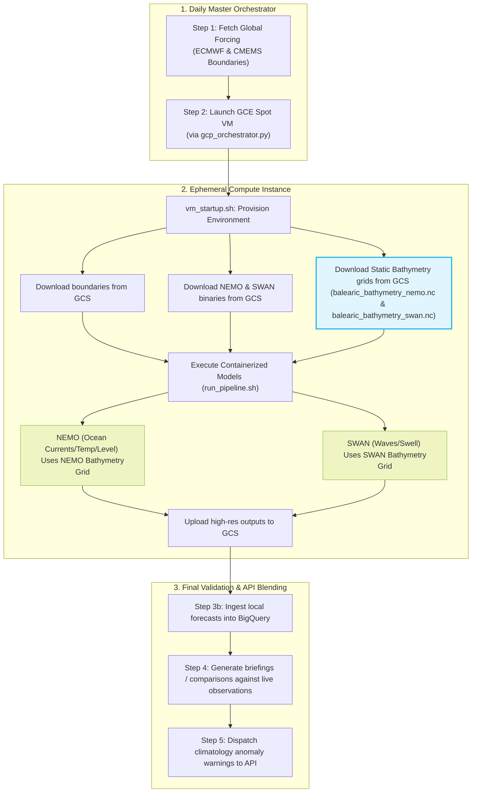

# PredSea Operational Guide: Western Mediterranean Bathymetry Integration

This document outlines the role and integration of the static bathymetry grids within the **PredSea Daily Forecasting Pipeline**. 

Our bathymetric data covers the entire Western Mediterranean region (`lon: [-6.0, 12.0]`, `lat: [35.0, 44.5]`) on a high-resolution `0.01°` (~1km) regular grid. It acts as a static boundary input essential for accurate physical modeling of ocean currents, sea surface height, and coastal wave propagation.

---

## 📅 Daily Operational Flow: Where Bathymetry is Used

The bathymetry grids are uploaded once to Google Cloud Storage (GCS) as static reference files. In the daily operational run, they are downloaded and consumed during the simulation phase on the ephemeral **GCE Spot VM**.



---

## 🔍 Detailed Component Role

### 1. Provisioning & Ingestion Phase (`vm_startup.sh`)
When the **Daily Orchestrator** creates the GCE Spot VM instance, the startup script [vm_startup.sh](file:///Users/charles.santana/Kultrip/predsea-system/scripts/vm_startup.sh) executes. 

In Section 5, the VM retrieves the static bathymetry NetCDFs directly from Google Cloud Storage:
```bash
echo "Downloading static bathymetry grids from GCS..."
gsutil cp "gs://${GCS_BUCKET}/static/bathymetry/balearic_bathymetry_nemo.nc" /workspace/inputs/static/balearic_bathymetry_nemo.nc
gsutil cp "gs://${GCS_BUCKET}/static/bathymetry/balearic_bathymetry_swan.nc" /workspace/inputs/static/balearic_bathymetry_swan.nc
```
These NetCDFs are mounted inside the Docker modeling container, making them accessible to the simulation codes.

---

### 2. Numerical Physics Modeling Phase (`run_pipeline.sh`)

#### 🌊 NEMO Hydrodynamics Model (`nemo.exe`)
* **Grid File Used**: `balearic_bathymetry_nemo.nc` (21 MB)
* **Conventions**: Orthogonal curvilinear grid format with 2D coordinate arrays (`nav_lon`, `nav_lat`) mapped to dimensions (`y`, `x`) and the standard positive bathymetric depth variable `bathy`.
* **Physical Role**: 
  NEMO uses depth values to establish 3D vertical layers (z-coordinates / s-coordinates) across the Western Mediterranean basin. Accurate bathymetry is vital for solving Navier-Stokes equations:
  * **Topographic Steering**: Deep-water canyons and shallow coastal shelves redirect current vectors (`u`, `v`).
  * **Sea Surface Elevation**: The volume of water in shallow water determines how tide and atmospheric pressures wave heights build up (`zeta`).
  * **Thermal Inertia**: Deep ocean basins hold heat differently than shallow waters, directly impacting sea surface temperature (`temp`) and salinity (`salt`) transport equations.

#### 🏄 SWAN Wave Model (`swan.exe`)
* **Grid File Used**: `balearic_bathymetry_swan.nc` (7 MB)
* **Conventions**: Standard 1D coordinate dimensions (`latitude`, `longitude`) with positive-downward bathymetric depth array (`depth`).
* **Physical Role**:
  SWAN solves the wave action balance equation. As wind waves propagate from deep ocean boundaries to coastal regions, their dynamics are governed heavily by local depths:
  * **Shoaling**: When waves enter shallow water, the seafloor slows down the wave bottom, compressing energy and increasing wave height (`wave_m`).
  * **Refraction**: Wave crests bend towards shallow regions, rotating wave direction angles (`wave_direction_deg`).
  * **Bottom Friction**: Energy is dissipated through interaction with the seafloor.
  * **Depth-Limited Breaking**: Waves break when water depth becomes shallow enough (typically when depth $\approx 1.28 \times$ wave height), dissipating massive energy.

---

### 3. Output Generation & Blending Phase
1. After simulation completion, NEMO and SWAN write hourly, high-resolution NetCDFs representing physical variables.
2. The GCE Spot VM pushes the outputs back to `gs://predsea-daily-outputs/predictions/`.
3. The orchestrator triggers Step 3b ingestors to write predictions to BigQuery `evidence_rows`.
4. The API [app.py](file:///Users/charles.santana/Kultrip/predsea-system/humanintheloop/api/app.py) seamlessly serves these high-resolution local forecast grids for Days 1–5, automatically transitioning to global fallback models for Days 6–10.
