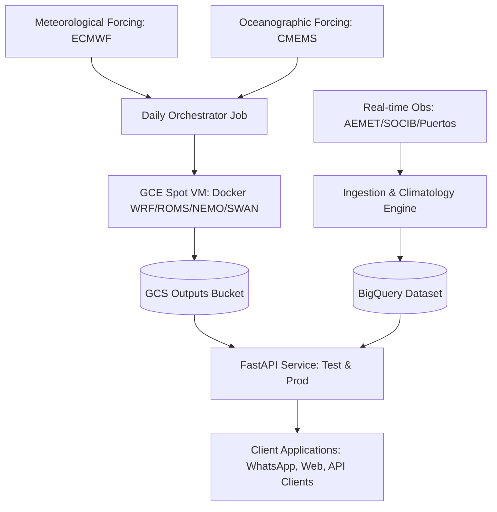
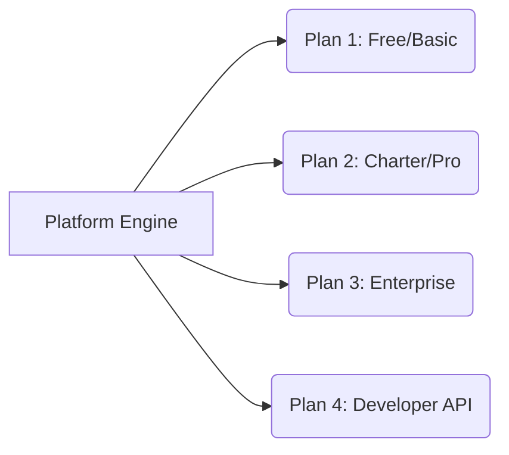

# PredSea: Product Catalog, API Reference & Strategic Roadmap

This document serves as the master specification, technical directory, and product management framework for the **PredSea** platform. It consolidates every component, model, data pipeline, and API endpoint developed to date. 

The goal of this document is to assist the executive and product teams in:
1. **Commercial Packaging**: Categorising features into commercial pricing tiers (e.g., Free, Charter, Enterprise).
2. **Product Roadmap**: Setting development priorities for future engineering cycles.

---

# 1. Executive Architecture & Product Overview

PredSea is a high-resolution, end-to-end meteorological and oceanographic forecasting platform tailored for maritime safety, navigation, and weather routing. Rather than relying on coarse global models, PredSea integrates physical simulations, localized observations, and climatological baselines to deliver hyper-local, predictive insights.



---

# 2. Core Technological Capabilities (The "What is Built")

### A. Numerical Weather & Ocean Modeling Suite
PredSea does not just consume data; it runs its own daily regional forecasts. Every day, the orchestrator provisions ephemeral Google Compute Engine **Spot VMs** (`c2d-standard-32` instances in `europe-west1-b`) running Docker containers to solve complex hydrodynamic equations.
*   **WRF (Weather Research & Forecasting)**: Localized atmospheric modeling (wind shear, gusts, air temp, barometric pressure).
*   **CROCO/ROMS (Coastal and Regional Ocean Community Model)**: Localized coastal ocean circulation, capturing fine-scale eddy and current structures.
*   **NEMO (Nucleus for European Modelling of the Ocean)**: High-resolution Mediterranean ocean physics, temperature, salinity, and density fields.
*   **SWAN (Simulating WAves Nearshore)**: High-fidelity shallow-water wave spectrum modeling (significant wave height, swell direction, peak wave period).

### B. Observation, Ingestion & Real-Time Validation
To maintain high scientific accuracy, PredSea pulls physical observations hourly and compares them with predicted grids to calculate model bias.
*   **AEMET (Spanish Meteorological Agency)**: Feeds shore-based wind, temperature, and atmospheric pressure.
*   **SOCIB (Balearic Islands Coastal Observing System)**: Oceanographic deep-sea buoys, high-frequency coastal radars (surface currents), and autonomous glider telemetry.
*   **Puertos del Estado**: Port-specific tide gauges, harbor wave buoys, and meteorological sensors.
*   **EMODnet (European Marine Observation and Data Network)**: Feeds oceanographic telemetry for French and Italian harbors and coastal buoys.

### C. Climatology Baseline & Intelligent Anomaly Engine
PredSea maintains a multi-year baseline dataset (`climatology_baseline`) inside BigQuery.
*   **Z-Score Calculation**: When real-time observations are ingested, they are benchmarked against historical monthly/hourly standard deviations.
*   **Operational Stance Warnings**: If physical values exceed a threshold (e.g., Z-Score > 1.5 or 2.0), the anomaly engine automatically generates severe or moderate alerts. These are merged with official CAP (Common Alerting Protocol) warnings from AEMET to form an active hazards feed.

### D. Chronological Weather Routing Personalization
The crown-jewel routing feature of PredSea calculates an optimal path (e.g., Palma to Valencia or Marseille to Genoa) and matches waypoint forecast queries with **the actual estimated time of arrival (ETA)** of the vessel at that coordinate. As the vessel sails, forecast checks shift forward in time dynamically rather than querying static daily snapshots.

### E. Precise Geodesics & World Magnetic Model (WMM)
Using `pygeomag` and the WMM coefficient databases, PredSea computes localized **magnetic variations** dynamically for any given latitude, longitude, and date. This allows real-time correction of GPS true headings to magnetic compass headings.

---

# 3. Complete API Endpoint Directory

The API is fully responsive, containerized on Cloud Run, and split into isolated `test` and `prod` endpoints.

### Navigation & Routing Endpoints
| HTTP Method | Endpoint | Description | Key Parameters | Response Format (Core Keys) |
| :--- | :--- | :--- | :--- | :--- |
| **GET** | `/routes/optimal/{origin}/{destination}` | **Chronological Weather Routing**. Calculates optimal routes with checkpoints aligned to the vessel's arrival times. | `date` (YYYY-MM-DD), `departure_time` (HH:MM), `vessel_class` | `origin`, `destination`, `distance_nm`, `estimated_time_h`, `waypoints` (lat, lng), `checkpoints` (eta_local, wind, wave, current) |
| **GET** | `/navigation/magnetic-variation` | Dynamic World Magnetic Model calculation to correct true headings to magnetic headings. | `latitude`, `longitude`, `date` (YYYY-MM-DD) | `latitude`, `longitude`, `date`, `magnetic_variation_deg` |
| **GET** | `/routes` | Returns the registry of precomputed standard routes. | None | List of objects: `route_id`, `origin`, `destination`, `distance` |
| **GET** | `/routes/{route_id}/briefing` | Generates a comprehensive plain-text and structured briefing report for a route. | `date`, `run` | `route_id`, `generated_at_utc`, `briefing_text`, `met_conditions` |
| **GET** | `/routes/{route_id}/media` | Resolves visual media assets (plots, satellite loops, wave maps) for a routing briefing. | `date`, `run` | `route_id`, `media_assets` (lists of image/video URLs) |
| **GET** | `/places/distance` | Returns distances between registered harbor/coastal hubs. | `origin`, `destination` | `distance_nm`, `origin_id`, `destination_id` |

### Hazards & Warnings Endpoints
| HTTP Method | Endpoint | Description | Key Parameters | Response Format (Core Keys) |
| :--- | :--- | :--- | :--- | :--- |
| **GET** | `/warnings/active` | **Intelligent Anomaly Feed**. Merges official alerts with PredSea's statistical Z-score anomalies. | `route`, `place`, `z_threshold` (default: 1.5), `lookback_hours` | `generated_at_utc`, `summary` (moderate/severe counts), `operational_stance`, `warnings` (details) |
| **POST**| `/warnings/active` | Allows ingestion pipelines to push pre-calculated active warnings into the live API cache. | JSON list of `WarningItem` | `status`: "success", `count`, `message` |
| **GET** | `/routes/{route_id}/gmdss` | Fetches active GMDSS (Global Maritime Distress and Safety System) alerts specific to a route. | `date`, `run` | `route_id`, `active_warnings` (JSON list) |
| **GET** | `/warnings/gmdss` | Returns all active global GMDSS alerts loaded in the system. | None | `generated_at`, `warnings` (full catalog) |

### Validation & Diagnostic Endpoints
| HTTP Method | Endpoint | Description | Key Parameters | Response Format (Core Keys) |
| :--- | :--- | :--- | :--- | :--- |
| **GET** | `/health` | Live system health check. Discovers storage configuration and active deployment environment. | None | `status`: "ok", `storage_backend`, `environment` (e.g., "test" or "prod") |
| **GET** | `/routes/{route_id}/evidence` | Returns physical validation pairings comparing model outputs vs real-time buoys along a route. | `date` | `route_id`, `evidence_rows` (sensor comparisons, deviations) |
| **GET** | `/places/{place_id}/weather` | Returns weather observation history and forecasts for a harbor/sensor location. | `place_id` | `place_id`, `name`, `observations` (history), `forecast_grid` |
| **GET** | `/places/resolve` | Decodes messy/fuzzy user queries into canonical place registry IDs. | `query` (e.g. "San Ant") | `query`, `resolved_place_id`, `confidence` |

---

# 4. Geographical Reach, Resolution, and Frequencies

Understanding our bounds is crucial for defining our commercial limits:

### A. Geographical Boundaries (The Western Mediterranean Basin)
Rather than being limited to the Balearic Islands, PredSea covers the entire **Western Mediterranean Basin** across Spain, France, and Italy:
*   **Active Modeling Domain**: Latitude **35.0°N to 45.0°N** | Longitude **3.0°W to 11.0°E** (extending eastward to Sicily/Messina).
*   **Port & Regional Registry Coverage (By Country)**:
    *   🇪🇸 **Spain (Balearics & Mainland)**:
        *   *Balearic Islands*: Palma, Alcúdia, Ibiza Town, Sant Antoni de Portmany, Formentera, La Savina, Mahón, Ciutadella, Port Adriano, Portocolom, Port de Palma, Sóller, Can Pastilla, Puerto Portals, Port d'Andratx, Cala Fornells (Fornells), Port d'Addaia, Cabrera, West Ibiza region.
        *   *Mainland Coast*: Valencia, Barcelona, Tarragona, Palamós.
    *   🇫🇷 **France (Mediterranean Coast)**: Marseille, Toulon, Montpellier (Sète).
    *   🇮🇹 **Italy (Sardinia, Sicily & Mainland)**: Genoa, Naples, Cagliari (Sardinia), Palermo (Sicily), Messina (Sicily).

### B. Grid Resolution & Horizon
*   **Atmosphere (WRF)**: 4 km horizontal grid resolution.
*   **Waves (SWAN)**: 1 km horizontal coastal grid resolution.
*   **Forecast Horizon**: **120 hours (5 Days)** calculated daily in hourly intervals.

### C. Frequency & Update Cycles
*   **Modeling runs**: Once daily at **03:00 AM Europe/Madrid time**.
*   **ECMWF / CMEMS boundaries fetching**: Once daily.
*   **AEMET/SOCIB physical observation ingestion**: Every **1 hour** (real-time).
*   **CAP / GMDSS hazard updates**: Checked and ingested every **15 minutes**.

---

# 5. Product Packaging Matrix (Commercial Plans)

To monetize the technology, we propose packaging our capabilities into four distinct plans:



| Capabilities / Features | Tier 1: Free/Basic | Tier 2: Charter/Pro | Tier 3: Enterprise / Cargo | Tier 4: Developer API |
| :--- | :--- | :--- | :--- | :--- |
| **Target Audience** | Recreational sailors, kayakers, beachgoers. | Yacht charters, professional skippers, sailing schools. | Commercial shipping lines, maritime ports, logistics. | Third-party maritime software, GPS hardware integrators. |
| **Core Routing** | Standard pre-calculated routes (Palma - Valencia) with static weather. | **Personalized Chronological Routing** (Any custom speed/departure). | **Advanced Optimal Routing** + Multi-Vessel Fleet Tracking. | Full programmatic access to the routing engine. |
| **Geodesics & Heading** | No magnetic variation correction. | Includes **World Magnetic Model** correction. | World Magnetic Model + Autopilot NMEA stream integrations. | WMM coordinate API endpoint. |
| **Intelligent Warnings** | Standard official alerts only (AEMET CAP). | **CAP Alerts + Real-time PredSea Anomaly Alerts** (Z-Score > 1.5). | Deep Custom Anomalies, SMS/WhatsApp Urgent Dispatch alerts. | Full raw hazard feed access. |
| **Validation Evidence** | Not available. | Simple validation metrics (Buoy temperatures/winds). | Deep sensor validation arrays to verify SLA accuracy. | Programmatic access to evidence rows. |
| **Model Resolution** | Global coarse grids (GFS 25km). | **High-Res PredSea Grids** (WRF 4km / SWAN 1km). | **Ultra High-Res Grids** + Custom sub-kilometer domains. | Access to high-resolution netCDF layers. |
| **Update Frequency** | Once every 24 hours. | Real-time hourly observations. | Continuous sub-hourly stream ingestion. | Rate-limited by API quota. |
| **Pricing Model** | Ad-supported / Free. | €19 - €49 / Month per vessel. | €250+ / Month per vessel (SLA backed). | Quota-based (€0.05 per API call / monthly flat). |

---

# 6. Strategic Product Roadmap

This roadmap structures future development into logical phases based on our existing architecture.

```carousel
# Phase 1: Client Access & Distribution
- **WhatsApp Webhook Bot**: Deploy an automated bot using the existing place resolver and `/places/{place_id}/weather` endpoint. Skippers can text "Palma weather" or "Route Palma to Valencia at 08:00" and get instant briefings.
- **Interactive Web Widgets**: Build clean, embeddable HTML5 Leaflet map widgets utilizing our `/maps/overlays` tile endpoints so charter websites can embed real-time sea-state maps.
<!-- slide -->
# Phase 2: Vessel Performance Optimization
- **Dynamic Polar Route Optimization**: Integrate vessel polar diagrams (speed performance curves based on wind angle and waves). The `/routes/optimal` endpoint will dynamically adjust the trajectory to maximize fuel efficiency and comfort, rather than just chronological weather matching.
- **Fuel Consumption Analytics**: Use CROCO ocean currents and WRF winds to calculate fuel savings and carbon reduction statistics along the route.
<!-- slide -->
# Phase 3: Boundary Expansion & Port Integrations
- **Geographical Boundary Expansion**: Copy the `infra/setup_environments.sh` paradigm to spin up new VM modeling boundaries for the Canary Islands, Gibraltar Strait, and the North Sea.
- **Port Authority Dashboards**: Combine tide gauges, Puertos observations, and SWAN modeling into a dedicated B2B dashboard for harbor masters to predict swell docking hazards.
<!-- slide -->
# Phase 4: Machine Learning Bias Calibration
- **Real-time Calibration Engine**: Utilize the BigQuery `model_bias` and historical `evidence_rows` to feed a Machine Learning regressor. This engine will dynamically offset WRF/SWAN raw predictions based on local coastal buoy deviations, bringing prediction accuracy down to near-zero error margins.
```
