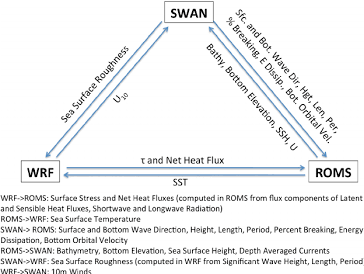
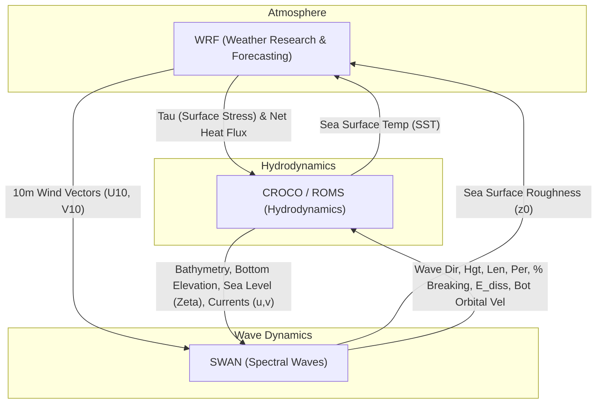

# 02. Core Numerical Engines & Coupling Mechanisms

This document provides a mathematical and functional analysis of the core numerical modeling engines integrated into the **PredSea** forecasting suite: **WRF** (atmospheric dynamics), **CROCO** (hydrodynamics), and **SWAN** (spectral wave dynamics), alongside their two-way and three-way coupling interfaces via the **OASIS3-MCT / COAWST** framework.

---

## 1. Core Numerical Modeling Engines

```
+-----------------------------------------------------------------------------------+
|                            PredSea Modeling Suite                                 |
|                                                                                   |
|  +--------------------+    +--------------------+    +-------------------------+  |
|  |     WRF v4.5       |    |    CROCO v2.1.3    |    |       SWAN v41.45       |  |
|  |  (Atmosphere 1km)  |    |  (Hydrodynamic 1km)|    |  (Spectral Waves 1km)   |  |
|  +---------+----------+    +---------+----------+    +------------+------------+  |
|            |                         |                            |               |
|            | Surface Fluxes          | Wave Radiation Stress      | Currents &    |
|            | (tau, shflux, SST)      | & Bottom Friction          | Sea Level     |
|            v                         v                            v               |
|  +-----------------------------------------------------------------------------+  |
|  |                       OASIS3-MCT / COAWST Coupler                           |  |
|  +-----------------------------------------------------------------------------+  |
+-----------------------------------------------------------------------------------+
```

### A. WRF (Weather Research and Forecasting Model)
The atmospheric component runs WRF v4.5, solving the fully compressible, non-hydrostatic Euler primitive equations on a Arakawa-C grid using terrain-following hydrostatic pressure vertical coordinates ($\eta$).

*   **Primary Governing Variables**: 3D velocity vectors ($\vec{u}_a$), perturbation potential temperature ($\theta'$), geopotential ($\phi'$), and surface pressure ($P_{atm}$).
*   **Physical Parameterizations**:
    *   **Microphysics**: WSM6 (WRF Single-Moment 6-class scheme).
    *   **Planetary Boundary Layer (PBL)**: YSU (Yonsie University scheme) resolving atmospheric turbulence and surface momentum flux closure.
    *   **Radiation**: RRTMG longwave and shortwave schemes computing surface downward fluxes ($SW_{\downarrow}, LW_{\downarrow}$).
*   **Output Parameters**: Provides $10\text{ m}$ wind vectors ($U_{10}, V_{10}$), $2\text{ m}$ air temperature ($T_a$), specific humidity ($q_a$), surface pressure ($P_{atm}$), and radiative fluxes ($SW_{\downarrow}, LW_{\downarrow}$).

### B. CROCO (Coastal and Regional Ocean Community Model)
CROCO v2.1.3 is a free-surface, hydrostatic/non-hydrostatic 3D primitive equation hydrodynamic model evolved from ROMS. It uses an Arakawa-C grid in the horizontal and a general curvilinear, terrain-following $s$-vertical coordinate system in the vertical.

#### Hydrodynamic Governing Equations
In Cartesian/curvilinear coordinates with terrain-following $s$-levels, the Reynolds-averaged Navier-Stokes (RANS) momentum equations under the Boussinesq and hydrostatic approximations are:

$$\frac{\partial u}{\partial t} + \vec{v} \cdot \nabla u - f v = -\frac{1}{\rho_0} \frac{\partial p}{\partial x} + \frac{\partial}{\partial z} \left( K_m \frac{\partial u}{\partial z} \right) + \mathcal{D}_u$$

$$\frac{\partial v}{\partial t} + \vec{v} \cdot \nabla v + f u = -\frac{1}{\rho_0} \frac{\partial p}{\partial y} + \frac{\partial}{\partial z} \left( K_m \frac{\partial v}{\partial z} \right) + \mathcal{D}_v$$

$$\frac{\partial p}{\partial z} = -\rho g$$

$$\frac{\partial u}{\partial x} + \frac{\partial v}{\partial y} + \frac{\partial w}{\partial z} = 0$$

Where:
*   $u, v, w$ are the 3D fluid velocity components in $x, y, z$.
*   $f = 2\Omega \sin\phi$ is the Coriolis parameter.
*   $\rho_0$ is the reference ocean water density ($1025\text{ kg/m}^3$).
*   $K_m$ is the vertical eddy viscosity derived from GLS (Generic Length Scale) $k$-$\epsilon$ or $k$-$\omega$ turbulence closure.
*   $\mathcal{D}_u, \mathcal{D}_v$ represent horizontal viscosity and dissipation operator terms.

#### Stretched $s$-Vertical Coordinate System
To resolve both deep ocean circulation and shallow coastal boundary layers, CROCO employs a non-linear vertical transformation (`NEW_S_COORD`):

$$z(x, y, s) = \zeta(x, y) + [\zeta(x, y) + h(x, y)] \cdot S(x, y, s)$$

Where the non-linear stretching function $S(x, y, s)$ is governed by parameters $\theta_s$ (surface stretching), $\theta_b$ (bottom stretching), and $h_c$ (critical depth):

$$S(x, y, s) = \frac{h_c s + h C(s)}{h_c + h}$$

In the reference Balearic grid ($401 \times 501$ horizontal grid at $1\text{ km}$ resolution), $N=32$ vertical layers are configured with $\theta_s = 6.0$, $\theta_b = 0.0$, and $h_c = 10\text{ m}$.

### C. SWAN (Simulating WAves Nearshore)
SWAN v41.45 is a third-generation spectral wave model that computes the evolution of the 2D wave action density spectrum $N(\sigma, \theta; x, y, t)$ over coastal and shelf sea environments:

$$N(\sigma, \theta) = \frac{E(\sigma, \theta)}{\sigma}$$

Where $\sigma$ is the relative wave intrinsic frequency and $\theta$ is the wave propagation direction.

#### Spectral Action Balance Equation
The governing wave transport equation in absolute Cartesian coordinates is given by:

$$\frac{\partial N}{\partial t} + \frac{\partial}{\partial x} (c_x N) + \frac{\partial}{\partial y} (c_y N) + \frac{\partial}{\partial \sigma} (c_\sigma N) + \frac{\partial}{\partial \theta} (c_\theta N) = \frac{S_{tot}}{\sigma}$$

Where:
*   $(c_x, c_y) = \vec{c}_g + \vec{U}$ are the spatial propagation velocity components (group velocity $\vec{c}_g$ plus background current vector $\vec{U}$).
*   $c_\sigma, c_\theta$ represent the propagation speeds in spectral frequency $\sigma$ and direction $\theta$ (resolving current refraction and depth-induced shoaling).
*   $S_{tot}$ is the total source/sink term:

$$S_{tot} = S_{in} + S_{nl3} + S_{nl4} + S_{ds} + S_{bot} + S_{db}$$

Where $S_{in}$ is wind input, $S_{nl3}, S_{nl4}$ are 3-wave (triad) and 4-wave (quadruplet) non-linear interactions, $S_{ds}$ is whitecapping dissipation, $S_{bot}$ is bottom friction, and $S_{db}$ is depth-induced wave breaking.

---

## 2. Inter-Model Exchange Dynamics (WRF - SWAN - CROCO)

The complete three-way feedback mechanism across WRF, SWAN, and CROCO (ROMS) is illustrated in the architectural figure below:



*Figure 2.1: Inter-model exchange dynamics within the COAWST framework, defining variable feedback paths between WRF (atmosphere), SWAN (waves), and CROCO/ROMS (hydrodynamics).*



### Detailed Directional Exchange Vector Breakdown

#### 1. WRF $\rightarrow$ CROCO (ROMS)
*   **Surface Stress ($\tau$) & Net Heat Flux**: WRF provides atmospheric surface stress vectors ($\tau_x, \tau_y$) and component radiative/turbulent heat fluxes ($\text{radsw}, \text{shflx\_rlw}, \text{shflx\_lat}, \text{shflx\_sen}$) to drive ocean surface momentum and mixed-layer thermodynamics in CROCO.

#### 2. CROCO (ROMS) $\rightarrow$ WRF
*   **Sea Surface Temperature (SST)**: CROCO returns updated $1\text{ km}$ spatial SST fields back to WRF. This dynamic SST feedback prevents atmospheric boundary layer temperature drift and corrects surface sensible/latent heat transfer coefficients.

#### 3. SWAN $\rightarrow$ CROCO (ROMS)
*   **Wave Parameters & Bottom Kinematics**: SWAN transmits surface and bottom wave direction, significant wave height ($H_s$), wavelength ($L$), peak period ($T_p$), percent wave breaking fraction, energy dissipation rate ($E_{diss}$), and bottom orbital velocity ($U_{bot}$) into CROCO. These drive wave radiation stress gradients ($S_{xx}, S_{xy}, S_{yy}$) and enhance bottom boundary layer friction.

#### 4. CROCO (ROMS) $\rightarrow$ SWAN
*   **Hydrodynamic Conditions**: CROCO feeds updated bathymetry, bottom elevation changes, sea surface height ($\zeta$), and 3D depth-averaged currents ($u, v$) into SWAN. These adjust shallow-water shoaling limits, depth-induced wave breaking, and Doppler current refraction.

#### 5. SWAN $\rightarrow$ WRF
*   **Sea Surface Roughness ($z_0$)**: SWAN computes wave-age and steepness dependent aerodynamic surface roughness length ($z_0$) from significant wave height, length, and period, passing it to WRF to adjust atmospheric drag coefficients ($C_D$).

#### 6. WRF $\rightarrow$ SWAN
*   **Surface Wind Forcing ($U_{10}, V_{10}$)**: WRF passes high-resolution $10\text{ m}$ wind velocity vectors into SWAN to drive spectral wave growth ($S_{in}$).

---

## 3. Summary of Coupler Data Exchange Matrix

| Source Model | Target Model | Exchange Variable | Symbol / Units | Physical Coupling Effect |
| :--- | :--- | :--- | :---: | :--- |
| **WRF** | **CROCO** | Surface Stress & Heat Flux | $\tau, \text{shflux}$ ($\text{N/m}^2, \text{W/m}^2$) | Drives Ekman currents & water column thermal structure |
| **CROCO** | **WRF** | Sea Surface Temperature | $\text{SST}$ ($^\circ\text{C}$) | Modulates atmospheric boundary layer stability & flux coefficients |
| **SWAN** | **CROCO** | Wave Height, Period & $U_{bot}$ | $H_s, T_p, U_{bot}$ ($\text{m}, \text{s}, \text{m/s}$) | Drives wave radiation stresses & bottom friction enhancement |
| **CROCO** | **SWAN** | Currents & Sea Surface Height | $u, v, \zeta$ ($\text{m/s}, \text{m}$) | Causes Doppler shift, wave refraction, & depth-induced breaking |
| **SWAN** | **WRF** | Surface Roughness Length | $z_0$ ($\text{m}$) | Adjusts atmospheric surface drag based on real wave state |
| **WRF** | **SWAN** | $10\text{ m}$ Surface Wind Vectors | $U_{10}, V_{10}$ ($\text{m/s}$) | Governs spectral wave energy generation ($S_{in}$) |
