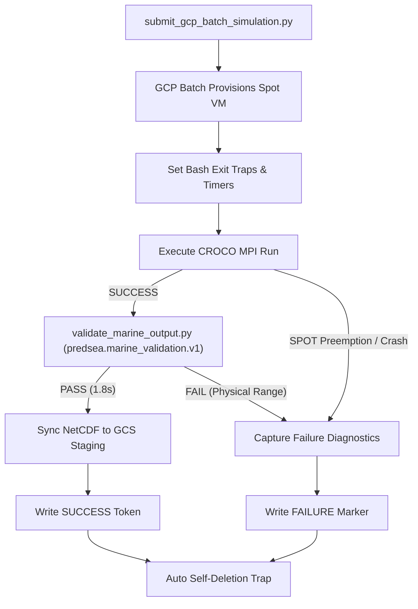

# 05. Cloud Deployment & Serverless Operations

This document describes the cloud-native, serverless execution framework developed for **PredSea** using **Google Cloud Platform (GCP) Batch**, **Spot VM instances**, and automated cost-protection mechanisms.

---

## 1. Containerized HPC Engine (`croco-batch:20260726-v20`)

Rather than maintaining dedicated, static HPC server hardware, the entire numerical modeling environment—including compiled Fortran 90 binaries for CROCO 2.1.3 and SWAN 41.45, OpenMPI execution runtimes, NetCDF C/Fortran libraries, and Python spatial post-processors—is encapsulated in an immutable Docker container image.

```
+-----------------------------------------------------------------------------------+
|               PredSea Unified HPC Container Architecture                          |
|                                                                                   |
|  +-----------------------------------------------------------------------------+  |
|  | Base OS: Ubuntu 22.04 LTS + OpenMPI 4.1 + gfortran / gcc                      |  |
|  +-----------------------------------------------------------------------------+  |
|  | Compiled Binaries:                                                          |  |
|  |  - croco_balearic.exe (CROCO 2.1.3 MPI binary)                             |  |
|  |  - swan_balearic.exe  (SWAN 41.45 MPI binary)                              |  |
|  +-----------------------------------------------------------------------------+  |
|  | Python Environment: Python 3.11 + NetCDF4 + xarray + SciPy + NumPy           |  |
|  +-----------------------------------------------------------------------------+  |
|  | Automation Scripts:                                                         |  |
|  |  - run_marine_simulation.py  (Master entrypoint)                            |  |
|  |  - prepare_croco_forcing.py   (Parallel GIL-bypass pre-processor)            |  |
|  |  - validate_marine_output.py  (Dimension-aware C-grid physical validator)    |  |
|  +-----------------------------------------------------------------------------+  |
+-----------------------------------------------------------------------------------+
```

Image tags and digests are pinned in Artifact Registry across all 5 active Western Mediterranean regional shards:
`europe-west1-docker.pkg.dev/predsea-api/predsea-simulations/croco-batch:20260726-v20`
`Digest: sha256:164c921bae33d23094a8f0103d4b6f6cec8c2112671a26d7700d4fe86d4ca31d`

---

## 2. Dynamic Resource-Aware Compute Sizing & Regional Matrix

To prevent Out-Of-Memory (OOM) failures while minimizing compute expenditure, the submission orchestrator [`scripts/submit_gcp_batch_simulation.py`](file:///Users/charles.santana/Kultrip/predsea-system/scripts/submit_gcp_batch_simulation.py) provisions compute resources according to regional grid point densities:

$$\text{Grid Points} = \left( \frac{(\text{Lat}_{\text{max}} - \text{Lat}_{\text{min}}) \times 111,000}{H_{\text{res}}} \right) \times \left( \frac{(\text{Lon}_{\text{max}} - \text{Lon}_{\text{min}}) \times 111,000 \times \cos(\text{Lat}_{\text{mid}})}{H_{\text{res}}} \right)$$

### Regional Deployment Specifications (Western Mediterranean Suite)

All 5 Western Mediterranean regional simulation shards are configured on `c2d-highcpu-16` SPOT VM instances with 16 vCPUs and 16 MPI ranks:

| Region ID | Grid Points | Machine Type | Container Image Tag | MPI Ranks | Compute Spec |
| :--- | :---: | :---: | :--- | :---: | :---: |
| **Balearic 1km** | $200,901$ | `c2d-highcpu-16` | `croco-batch:20260726-v20` | 16 | 16 vCPU / 32 GiB |
| **Alboran 1km** | $124,203$ | `c2d-highcpu-16` | `croco-batch:20260726-v20` | 16 | 16 vCPU / 32 GiB |
| **Gulf of Lion 1km** | $121,649$ | `c2d-highcpu-16` | `croco-batch:20260726-v20` | 16 | 16 vCPU / 32 GiB |
| **Tyrrhenian 1km** | $391,379$ | `c2d-highcpu-16` | `croco-batch:20260726-v20` | 16 | 16 vCPU / 32 GiB |
| **Algerian 1km** | $282,273$ | `c2d-highcpu-16` | `croco-batch:20260726-v20` | 16 | 16 vCPU / 32 GiB |

---

## 3. Spot VM Preemptibility & Cost Safety Traps

Compute costs are reduced by **70%–90%** by leveraging GCP **Spot Instances**. To ensure fault tolerance and prevent runaway cloud billing:



1.  **Automated Self-Deletion Traps**: Compute nodes automatically self-destruct upon task exit, eliminating idle VM billing risks.
2.  **In-Cloud Validation Gate**: All assertions (`validate_marine_output.py`) run in-cloud directly inside the container before storage sync, requiring zero local downloads.
3.  **Run-Scoped Immutability**: Forecast outputs are committed to immutable GCS storage paths:
    `gs://predsea-daily-outputs-test/predictions/YYYY-MM-DD/runs/[RUN_ID]/`
