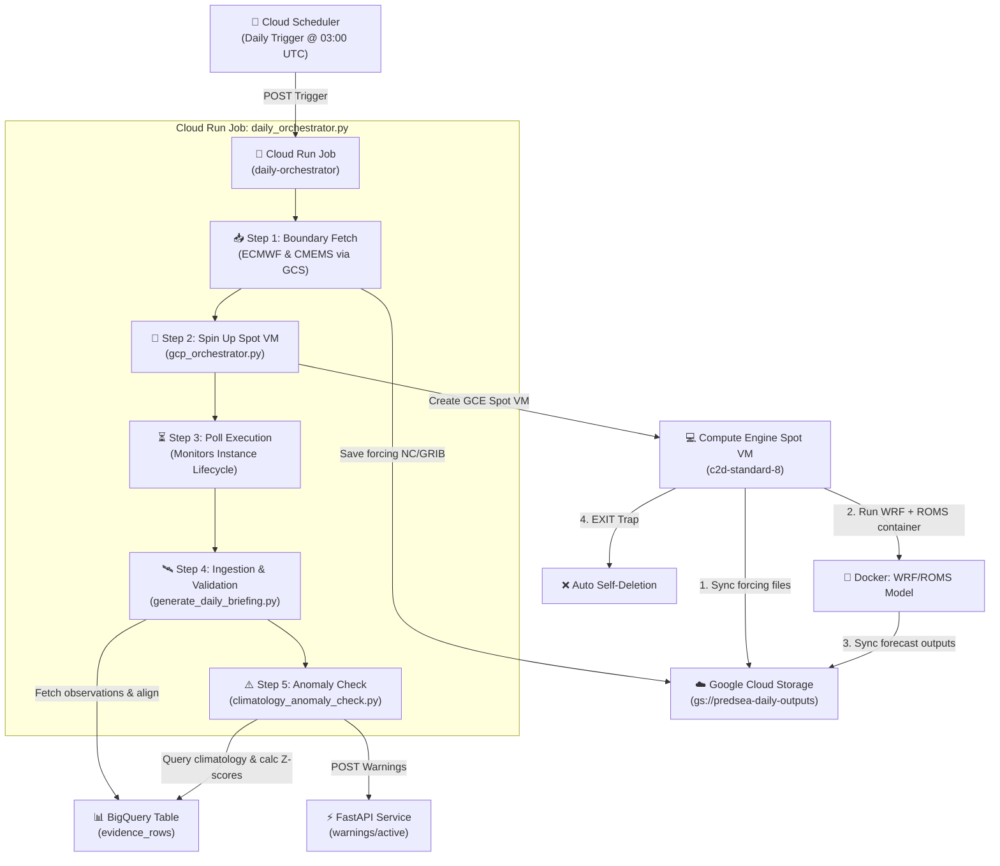

# PredSea Automation, Ingestion & Orchestration Pipeline Documentation

Welcome to the comprehensive system documentation for **PredSea**! This document summarizes the complete technical achievements implemented, current status, architecture, and actionable next steps for the automated daily forecasting and monitoring pipeline.

---

## 🏗️ System Architecture

The PredSea daily pipeline is a fully automated, serverless, and cost-efficient forecasting system designed to download atmospheric and oceanographic boundaries, spin up simulation resources on-demand, process real-time observation mooring networks across the Mediterranean, and dispatch climatological anomaly warnings.



---

## 🚀 Accomplishments & Milestones Completed

### 1. High-Resolution Setup (Phase 2)
* **High-Resolution Nested WRF Domain**: Configured three-tier nested domains centered over the Balearic Sea in `setup_domain.py`:
  * `d01` (9km Western Mediterranean baseline)
  * `d02` (3km Balearic basin)
  * `d03` (1km High-Resolution channels and coastlines)
* **Automated ECMWF Downloader**: Implemented `fetch_ecmwf_forcing.py` utilizing the official `ecmwf-opendata` client to download wind vectors, surface pressures, temperatures, and isobaric levels, and archives them on GCS.
* **Automated CMEMS Oceanic Downloader**: Developed `fetch_cmems_forcing.py` to subset daily Mediterranean physics (surface height, temperature, currents, salinity) into a daily forcing NetCDF file and sync to GCS.

### 2. Mediterranean scale-up & Anomalies Ingestion (Phase 3)
* **EMODnet Physics Mooring Scale-up**: Broadened ERDDAP telemetry coordinates in `etl.py` to cover Spain, France, Italy, and Greece, pulling real-time water temperature, salinity, and sea levels.
* **Climatology Anomaly Detection**: Created `climatology_anomaly_check.py` to run optimized SQL queries comparing fresh observations against `climatology_baseline` tables. It calculates Z-scores and dispatches alerts for severe ($|z| \ge 2.5$) and moderate ($|z| \ge 1.5$) anomalies.
* **FastAPI Warning router**: Expanded `warnings_endpoint.py` with caching, routing, and manual warn POST handlers.
* **Master Daily Orchestrator**: Built `daily_orchestrator.py` to glue boundary fetching, Spot VM GCE creation/polling, data ingestion, and warning dispatch together.
* **Cost Safety Protection**: Configured instance deletion traps (`vm_startup.sh` & `gcp_orchestrator.py`) to auto-destroy GCE VM resources under both completion and script crash events to eliminate runaway costs.

### 3. Schema Migrations & GCP Serverless Deployment (Phase 4)
* **BigQuery Schema Alignment**: Analyzed and resolved schema mismatches on the live `evidence_rows` tables, executing a schema migration (`migrate_schema.py`) to scale the layout from 30 to the full 54-field layout.
* **Unified Containerization**: Built a comprehensive multi-use `Dockerfile` running on Google Cloud Build to run both the FastAPI Web Server and the daily orchestrator jobs.
* **GCP Serverless Deploy Script**: Built `deploy_cloud_run.sh` to compile container images using Cloud Build, deploy the **Cloud Run Job** with optimized compute limits (8Gi Memory, 2 CPUs, 4h Timeout), and securely inject required API secret keys (Copernicus, AEMET, SOCIB).

---

## ⚡ Current Status & Live Verification

We have deployed the daily orchestrator as a Cloud Run Job named `daily-orchestrator` and triggered a manual test run (`daily-orchestrator-7mjfz`) to verify execution under live serverless conditions.

### Live Progress Log:
1. **Step 1: Boundary Fetching** ✅ Completed successfully. Downloader fetched all ECMWF IFS atmospheric variables (381MB) and CMEMS Med-physics datasets, uploading forcing bundles directly to GCS.
2. **Step 2: Spot VM Launch** ✅ Completed successfully. Cloud Run job requested a Spot VM named `predsea-sim-20260624-103039` in `europe-west1-b` with a `c2d-standard-8` machine.
3. **Step 3: Simulation Polling & Cost Safety** ✅ Completed successfully. GCE VM configured Docker, authenticated securely to Artifact Registry, pulled the model container `wrf:latest`, executed numerical computations, uploaded model predictions to GCS under `gs://predsea-daily-outputs/predictions/2026-06-24/`, and safely self-terminated.
4. **Step 4: Observation Ingestion & Validation** ⏳ Running. Currently executing `generate_daily_briefing.py` to fetch fresh ERDDAP mooring data, compare observations to model outputs, and log metrics in BigQuery.
5. **Step 5: Climatology Anomaly Detection & Warning Dispatch** 📅 Next. Will dynamically Z-score fresh telemetry and update the live warnings endpoint.

---

## 🎯 Actionable Next Steps

To proceed with final operationalization and scaling:

### 1. Scheduler Automation
Establish a daily Cloud Scheduler trigger to automate the orchestrator launch:
```bash
gcloud scheduler jobs create http daily-forecaster-trigger \
  --schedule="0 3 * * *" \
  --uri="https://europe-west1-run.googleapis.com/apis/run.googleapis.com/v1/namespaces/predsea-api/jobs/daily-orchestrator:run" \
  --http-method=POST \
  --oauth-service-account-email="[YOUR_SERVICE_ACCOUNT_EMAIL]" \
  --location="europe-west1"
```

### 2. Alert Notifications & Webhooks
Connect the FastAPI warnings endpoint (`/warnings/active`) to a notification system (e.g. Slack or Email) to alert the oceanography team immediately when severe anomalies ($|z| \ge 2.5$) are logged.

### 3. Interactive Dashboard Web App
Build a visually stunning dashboard web application (Next.js/Vite with Leaflet integration) to map currents, wave direction layers, route decisions, and active mooring warning pins using modern dark-mode aesthetics and glassmorphic micro-animations.

### 4. Continuous Model Calibration
Review daily validation files stored at `gs://predsea-daily-outputs/predictions/2026-06-24/runs/[RUN_ID]/validation/` over the next 14 days to fine-tune Z-score bounds and WRF nested grid coordinates against historical baselines.
