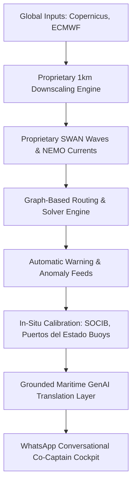

# PredSea — Comprehensive Agent Briefing & Context Document

This document serves as a high-fidelity technical and product briefing for PredSea. It is designed to be shared with other AI agents to provide complete context on our objectives, target audience, core company concept, website structure, and active development roadmap, including five specific areas of critical improvement.

---

## 1. Company Vision & Core Concept

### The Idea Behind the Company
PredSea is founded on an essential maritime truth: **captains do not suffer from a lack of weather data—they suffer from an abundance of raw complexity.** 

Standard weather systems inundate mariners with multiple, competing global forecasts (ECMWF, GFS, AROME), forcing them to manually parse coordinate grids, wind vectors, and wave swell directions while at the helm. This clinical, developer-centric presentation is mentally taxing and dangerous in heavy seas.

PredSea acts as an **expert, local co-captain**. We translate massive meteorological and oceanographic physics into high-confidence, natural-language, vessel-specific decision support. Rather than competing with weather models, we run our own proprietary simulations, verify them with in-situ oceanographic sensors, and deliver clear, plain-language routing and comfort recommendations natively via WhatsApp.

---

## 2. Product Objectives & Target Audience

### Core Objectives
1. **Frictionless Interface**: Deliver passage briefings entirely through a conversational WhatsApp cockpit interface. No new software to learn or heavy apps to open in high seas.
2. **Evidence-Based Support**: Never command a ship. Provide clear, evidence-grounded routing and safety indicators so the captain retains absolute authority while backed by high-confidence physical data.
3. **Custom Vessel-Specific Guidance**: Factor the specific hull profile, vessel dimensions (draft, length), and cruising speeds directly into the wave-swell and current predictions to forecast exact vessel behavior and guest comfort.
4. **Local Grid Sovereignty**: Bypass low-resolution global models (10km - 25km) which fail to capture coastal interactions, island wave-shadows, and coastal winds.
5. **Efficiency & Safety**: Optimize routes to reduce fuel consumption by up to 15% and avoid high-risk maritime corridors.

### Target Audience ("The Public")
* **Professional Superyacht Captains & Yachtmasters**: Experienced seafarers responsible for multi-million-euro asset safety and VIP guest comfort. They speak in terms of swell periods, wind-against-tide, shoaling, and anchorage protection. They expect authoritative, evidence-backed advice—not robotic, oversimplified "green-light/red-light" interfaces.
* **Charter Fleet Operators**: Fleet managers coordinating safety, passage windows, and turnaround times for multiple yachts simultaneously.
* **Competent Recreational Mariners**: Vessel owners who want a reliable, local "co-captain" in their pocket to validate passage planning and route safety.

---

## 3. Tech Stack & Modeling Pipeline

PredSea operates a proprietary, end-to-end forecasting pipeline:

### 3.1 Proprietary Modeling Specifications
* **Coastal High-Resolution downscaling**: We run our own nested high-resolution (1km) grid simulations of coastal waves, currents, and wind interactions across the Western Mediterranean (with Mallorca as our initial springboard). We use configured engines like **SWAN** (Simulating Waves Nearshore) and **NEMO** (Nucleus for European Modelling of the Ocean).
* **Dual-Tier Temporal Resolution**:
  * **Days 1 to 5**: Ultra-fine hourly predictions.
  * **Days 6 to 10**: High-resolution 6-hourly predictions.
* **Calibration & Observation**: Continuous real-time validation against live physical buoys operated by **SOCIB** (Balearic Islands Coastal Observing and Forecasting System) and **Puertos del Estado** (Spain).

### 3.2 Graph-Based Route Solver Engine
PredSea implements an advanced maritime route optimization system that processes oceanic physics directly into safe, navigable coordinates:
* **Spatial Grid Representation**: The Copernicus sea grids are represented as a directed, weighted sparse graph. Each sea grid point serves as a node, with edges connecting up to 8 neighboring points. Diagonal edges are scaled by $\sqrt{2}$ in distance.
* **Asymmetric Ocean Currents (Vector Projections)**: Sea currents make travel times asymmetric. PredSea projects current vectors ($u$, $v$) directly onto the edge bearing:
  $$\text{Effective Speed} = \text{Vessel Base Speed} + \text{Projected Current Component}$$
  This adjusts transit speed dynamically (down to a minimum fallback of 0.5 knots to avoid division issues).
* **Dynamic Optimisation Priorities**:
  1. **`time` Mode**: Focuses purely on minimising travel duration.
     $$\text{Edge Weight} = \text{Travel Time}$$
  2. **`comfort` Mode**: Penalises high wave-swell environments.
     $$\text{Edge Weight} = \text{Travel Time} \times \left(1.0 + 0.4 \times \frac{\text{Wave Height}}{\text{Vessel Wave Limit}}\right)$$
  3. **`safety` Mode**: Enforces a strict wave height limit. It excludes any edge entirely if waves exceed the vessel limit, and applies a heavy safety multiplier inside the safe bounds:
     $$\text{Edge Weight} = \text{Travel Time} \times \left(1.0 + 2.0 \times \frac{\text{Wave Height}}{\text{Vessel Wave Limit}}\right)$$
* **Vessel Class Hard Limits**: Wave thresholds are tailored to vessel classes to prevent routing under dangerous conditions:
  * **Small Vessels (<10m)**: Hard exclusion above 1.0m waves.
  * **Medium Vessels (10-20m)**: Hard exclusion above 2.0m waves.
  * **Large Vessels (20m+)**: Hard exclusion above 3.5m waves.
* **Dijkstra Performance Solver**: Resolves the optimal path by compiling edge weights into a Compressed Sparse Row (CSR) matrix and solving it utilizing `scipy.sparse.csgraph.dijkstra`, outputting precise waypoint nodes, estimated passage duration, and average wave/current conditions.

### 3.3 Hazard Aggregator & Anomaly Engine
* **Official Safety Broadcasts**: Automatically ingests and parses official maritime safety warnings and hazard announcements from authorities in Spain (AEMET/Puertos), France (Météo-France), Italy, and European agencies.
* **Sensory Anomaly Detection**: Algorithmic tracking of real-time sensor and forecast deviations to detect sudden abnormalities (e.g. sharp, unexpected wave height spikes or rapid sea/air temperature surges relative to baseline regional models) and trigger immediate WhatsApp alerts.

---

## 4. Current Landing Page Component Mapping & Copy

The website is a premium single-page web app built with **Vite, React 19, TanStack Router, and CSS/Tailwind CSS v4**. It features a deep marine visual identity (electric cyan glows, dark glassmorphism, Space Grotesk header typography, and JetBrains Mono code elements).

Below is the mapping of components, their core copy, and their UX design:

| Component | Target File | Core Content & Copy Structure |
| :--- | :--- | :--- |
| **SiteHeader** | [SiteHeader.tsx](file:///Users/charles.santana/Kultrip/predsea-web/src/components/landing/SiteHeader.tsx) | Glassmorphic navbar displaying the PredSea logo, navigation anchors (`#technology`, `*#decisions`, `#pricing`, `#pilot`), and an electric-glowing "Launch App" CTA button. |
| **HeroSection** | [HeroSection.tsx](file:///Users/charles.santana/Kultrip/predsea-web/src/components/landing/HeroSection.tsx) | Premium hero layout featuring the headline: *"High-Confidence Decisions at the Helm for Captains"*. Underneath, a tagline explains the conversational WhatsApp co-captain. Displays a floating, glowing trust badge: **"Yachting Ventures — Verified Startup"**. Includes a prominent CTA to register for the 14-day free pilot. |
| **PartnersSection** | [PartnersSection.tsx](file:///Users/charles.santana/Kultrip/predsea-web/src/components/landing/PartnersSection.tsx) | An infinite-scrolling horizontal marquee carousel displaying monochrome logos of our core data integrations and ecosystem partners: Yachting Ventures, SOCIB, Copernicus, ECMWF, Puertos del Estado, and Google for Startups. The scroll pauses smoothly on hover. |
| **ResolutionGapSection** | [ResolutionGapSection.tsx](file:///Users/charles.santana/Kultrip/predsea-web/src/components/landing/ResolutionGapSection.tsx) | Technical, deep-dive section exposing the "Spatial Resolution Gap." It shows why standard global weather systems (10km grids) completely miss local wind tunnels and wave shoaling in crucial channels (like the Menorca Channel) and how our nested 1km resolution solves this for safe coastal route plotting. |
| **DataToDecisionsSection** | [DataToDecisionsSection.tsx](file:///Users/charles.santana/Kultrip/predsea-web/src/components/landing/DataToDecisionsSection.tsx) | Titled **"Complexity in. Operational decisions out."** This section charts how multi-layered input data (global models + live buoys) flows through our AI reasoning layer and vessel constraints to output evidence-based recommendations: *Optimal Departure Windows, Route Adjustments, Shelter Suggestions, and Onboard Comfort Predictions*. |
| **StartupVerificationSection** | [StartupVerificationSection.tsx](file:///Users/charles.santana/Kultrip/predsea-web/src/components/landing/StartupVerificationSection.tsx) | A heavy master component housing several sub-elements: 1. **Core Technology Matrix**: 5-stage pipeline detailing ingestion, downscaling, routing calculations, data-lineage logging, and API routing. 2. **WhatsApp Cockpit Showcase**: Displays a live, interactive mobile mockup showing mock WhatsApp briefings (swell heights, current vectors, and natural-language recommendations) operating side-by-side with telemetry sliders and spatial wave overlays. 3. **Founding Team Section**: Introduces our core team with detailed professional maritime and software profiles. |
| **CoverageSection** | [CoverageSection.tsx](file:///Users/charles.santana/Kultrip/predsea-web/src/components/landing/CoverageSection.tsx) | Focuses on our operational coverage area: the Western Mediterranean Sea (Mallorca, Ibiza, Menorca, and adjacent coastal corridors). Features a region-voting form for captains to request next-port grid expansions. |
| **DemoSection** | [DemoSection.tsx](file:///Users/charles.santana/Kultrip/predsea-web/src/components/landing/DemoSection.tsx) / [PredSeaLeafletMap.tsx](file:///Users/charles.santana/Kultrip/predsea-web/src/components/landing/PredSeaLeafletMap.tsx) | An interactive Leaflet map rendering localized forecast grids. Captains can toggle wave height and current velocity overlays, adjust transparency, and slide through the 5-day forecast time timeline to preview spatial resolution. |
| **PricingSection** | [PricingSection.tsx](file:///Users/charles.santana/Kultrip/predsea-web/src/components/landing/PricingSection.tsx) | Clear, transparent plan cards comparing our **Free Pilot Tier** (14-day WhatsApp access) and our **Master Captain Plan / Co-Captain Pro** (€49/month). The brief details exactly what features are offered in the free tier vs. the premium paid plan (see Section 4.1 below). |
| **PilotProgramSection** | [PilotProgramSection.tsx](file:///Users/charles.santana/Kultrip/predsea-web/src/components/landing/PilotProgramSection.tsx) | A structured boarding form capturing critical captain details, hull type (monohull/catamaran), vessel length/draft, cruising speed, and phone number to customize their WhatsApp Co-Captain profile. |
| **CurrentStageSection** | [CurrentStageSection.tsx](file:///Users/charles.santana/Kultrip/predsea-web/src/components/landing/CurrentStageSection.tsx) / [RoadmapSection.tsx](file:///Users/charles.santana/Kultrip/predsea-web/src/components/landing/RoadmapSection.tsx) | Visualizes PredSea’s progress phases: from initial research data models, active private charter pilots, up to the upcoming public SaaS launch with web console. |
| **SiteFooter** | [SiteFooter.tsx](file:///Users/charles.santana/Kultrip/predsea-web/src/components/landing/SiteFooter.tsx) | Displays the exact GPS coordinates of our base in Palma de Mallorca (39.5696° N, 2.6502° E) and the tagline: *"Crafted for the Western Mediterranean. Built for Independence."* |

### 4.1 Free vs. Paid (€49/month) Plan Specifications

| Feature / Capability | Free / Starter Tier (€0) | Co-Captain Pro Paid Plan (€49/mo) |
| :--- | :--- | :--- |
| **Weather & Wave Grids** | Coarse, standard global models (10km+). | **Proprietary nested 1km downscaling** (SWAN, NEMO, WRF). |
| **Temporal Granularity** | 6-hourly or 12-hourly resolution. | **Hourly granularity** for days 1–5, 6-hourly for days 6–10. |
| **Graph-Based Route Solver** | *Not Available* | **Graph Route Solver** optimized for **Time, Comfort, or Safety** modes. |
| **Dynamic Ocean Currents** | No current-assisted speed corrections. | Asymmetric current vectors projected onto routing legs. |
| **Sensor Buoy Calibration** | Uncalibrated, subject to data drift. | Real-time verification against **SOCIB** and **Puertos del Estado** buoys. |
| **Official Safety Advisories** | No automatic hazard parsing. | Aggregated, real-time bulletins from **Spain, France, Italy, and Europe**. |
| **Sensor Anomaly Triggers** | *Not Available* | Proactive push notifications for sudden swell or temperature surges. |
| **Vessel Comfort Customisation**| Generic baseline recommendations. | Vessel dimension constraint mapping (draft, length, hull class limits). |
| **Communication Platform** | Web-only dashboards. | **Conversational WhatsApp Cockpit Interface** with natural-language briefs. |

---

## 5. Critical Areas for Improvement & Technical Debt

To guide other agents in generating specific improvements, we have identified five core aspects of the landing page and backend API that need restructuring:

### A. The "High-Resolution" Map is Low-Resolution
* **The Issue**: In the "Co-Captain Interface" showcase section, the map overlay shown inside the mobile simulator is low-resolution and does not visually represent our actual fine-scale SWAN nested wave grids.
* **Improvement Needed**: Create a sharp, true-to-life vector grid or high-definition spatial canvas overlay representing localized coastal cell boundaries (e.g. sharp localized grid cells near island edges) to emphasize the 1km resolution visually.

### B. Founding Team Bio Corrections (Matt Bullamore)
* **The Issue**: Matt Bullamore’s bio card in `StartupVerificationSection.tsx` is currently formulated as a generic data ops engineer. This is inaccurate.
* **Improvement Needed**: Rewrite Matt's profile to align with his real role: a product-focused systems builder working heavily on AI systems and agent architectures. Emphasize that Matt and Kobus Wentzel work closely in the same Product + Technology area, collaborating directly on the conversational WhatsApp agent’s core logical and dialog flows.

### C. Overhauling the "Complexity In, Decisions Out" Copy
* **The Issue**: In `DataToDecisionsSection.tsx`, the copy and elements are misaligned with our core technology and philosophy in two major ways:
  1. It implies we are a simple data aggregator wrapping third-party forecasts (like Copernicus & SOCIB). This is wrong; **we run our own proprietary SWAN & NEMO nested models** at 1km intervals (hourly for days 1-5, 6-hourly for days 6-10).
  2. It lists "GO / NO-GO" as a primary output. This contradicts maritime reality. Captains make the decisions; PredSea provides **evidence-based routing and safety recommendations**.
* **Improvement Needed**: 
  * Rewrite the input layer cards to explicitly showcase our proprietary high-resolution Western Mediterranean models alongside national/global models.
  * Eliminate the binary "GO / NO-GO" card and reframe all output copy as **evidence-based routing, safety, and vessel comfort recommendations**.

### D. Visualizing Automated Hazard Warnings & Anomaly Detection
* **The Issue**: The landing page does not highlight two of our most powerful features:
  1. **Official Hazard Alerts**: Aggregated broadcasts from maritime authorities in Spain, Italy, France, and Europe.
  2. **Sensory Anomaly Detection**: Automatic triggers (like waves peaking suddenly beyond regional baselines) that fire instant warnings.
* **Improvement Needed**: Incorporate styled alert modules or a visual "Notification Stream" within the Co-Captain showcase or technology matrix. Show how actual alerts from Spain (AEMET/Puertos), France (Météo-France), and Italy are processed, and render a mockup of a sensory anomaly trigger (e.g., *"Anomaly Detected: 1.2m sudden swell height surge relative to baseline near Menorca channel — Warning issued"*).

### E. Fixing the Live Map API Endpoint Reliability
* **The Issue**: The active spatial overlay image url endpoint used on the landing page map (`https://predsea-api-193957983101.europe-west1.run.app/maps/overlays/wave_height/...`) experiences loading degradation, and the images do not render sharp coastal grid details reliably.
* **Improvement Needed**: We need to debug the backend API rendering script to ensure it correctly slices and outputs high-resolution, sharp coastal wave-height cell transparent PNG overlays, and implement a robust, high-performance caching layer to guarantee seamless landing page map performance.

---

> [!NOTE]
> This briefing document represents the exact, verified truth of PredSea's product positioning and architectural pipeline as of June 2026. Use this to review other codebase modules or share it with external specialized subagents.
