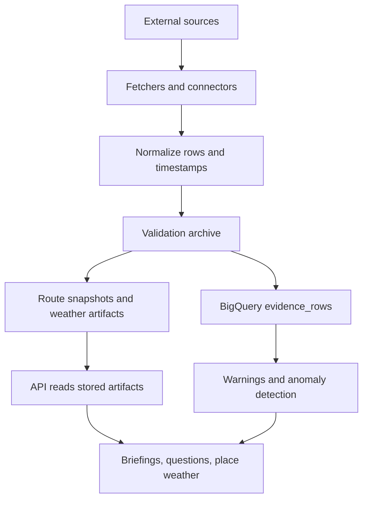

# PredSea API, ETL, and Data Flow

This document is the short operational map for PredSea: what data we use,
how it is ingested, how the ETL runs, and which API endpoints expose the
result.

## What PredSea uses

PredSea combines forecast, observation, and warning sources into one route
planning workflow.

### Forecast and atmospheric sources

- Copernicus Marine waves and currents
- ECMWF Open Data
- Meteo-France AROME
- AEMET HARMONIE-AROME

### Observation sources

- Puertos del Estado
  - REDMAR tide gauges
  - REDCOS coastal buoys
  - REDEXT offshore buoys
  - HF radar where a valid OPeNDAP dataset is available
- EMODnet Physics
- Portus observations and station metadata

### Warning sources

- AEMET CAP alerts
- PredSea anomaly detection from historical evidence

## How the ETL works

The ETL is the hourly production loop that turns raw forecast and observation
sources into the artifacts the API reads.



### Main ETL steps

1. Download and normalize forecast inputs.
2. Download and normalize observation inputs.
3. Sample observations at hourly resolution when the source is high-frequency.
4. Preserve the source timestamp from the dataset coordinate or CAP document.
5. Write the validation archive for the run.
6. Export observations and forecast evidence to BigQuery.
7. Precompute routes and route decision artifacts.
8. Publish the run bundles that the API reads.

### Timing

- The ETL is scheduled hourly.
- Observations are sampled at hourly resolution unless the source requires
  finer handling.
- The API always reads the latest stored artifacts for a given date/run.

## Warnings pipeline

The `/warnings/active` endpoint combines two independent warning streams:

1. **AEMET official CAP alerts**
   - The API requests the active CAP feed.
   - The download URL returned in the metadata is treated as a TAR archive.
   - The TAR is unpacked in memory.
   - Each XML CAP file is parsed.
   - Only `es-ES` info blocks are kept.
   - Only Balearic geo-code values beginning with `73` are kept.

2. **PredSea anomaly warnings**
   - The latest observations in BigQuery are compared against:
     - a rolling live window for fast-changing variables
     - a climatology baseline for seasonal or diurnal variables
   - Outliers become moderate or severe warnings.

The endpoint returns:

- `generated_at_utc`
- `context`
- `summary`
- `operational_stance`
- `warnings`
- `sources_available`

## API endpoints

### Health and metadata

- `GET /health`
- `GET /places`
- `GET /places/resolve`
- `GET /routes`
- `GET /routes/{route_id}/media`

### Places and location weather

- `GET /places/{place_id}/weather`
- `GET /locations/weather`
- `GET /distance`
- `GET /distance/coordinates`

### Routes and routing evidence

- `GET /routes/{route_id}/evidence`
- `GET /routes/{route_id}/briefing`
- `POST /routes/{route_id}/question`
- `GET /routes/{route_id}/waypoints`
- `GET /routes/{route_id}/status`

### Warnings

- `GET /warnings/active`
- `GET /warnings` (compatibility alias)

### Example calls

```bash
curl "http://127.0.0.1:8000/places/palma/weather?date=2026-06-21&run=latest"
curl "http://127.0.0.1:8000/routes/palma_ibiza/briefing?date=2026-06-21&run=latest&vessel_class=medium&format=whatsapp"
curl "http://127.0.0.1:8000/routes/palma_ibiza/question"
curl "http://127.0.0.1:8000/warnings/active?route=palma_ibiza"
```

## Where the API reads from

The API does not fetch the full live marine stack for every request. It reads
the stored artifacts produced by the ETL:

- validation archive snapshots
- route evidence bundles
- place-weather bundles
- route metadata and generated media

That keeps request-time responses fast and stable, while still preserving the
latest source lineage in the stored payloads.

## Why the source lineage matters

The API and docs expose the source lineage because the captain-facing answer is
only as good as the chain behind it. PredSea keeps track of:

- `source_family`
- `source_system`
- `source_label`
- station IDs and names
- sample timestamps
- freshness metadata

That lets us show what data was used, how recent it is, and whether the answer
came from observations, forecasts, or both.
